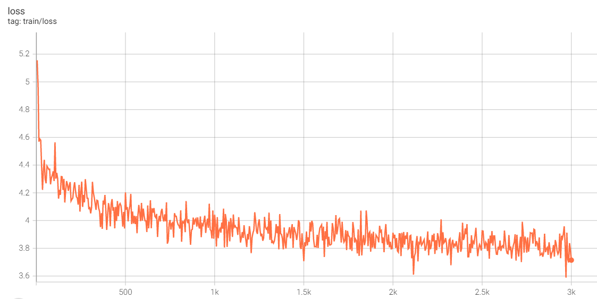
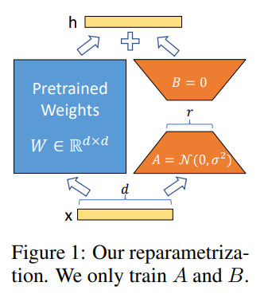
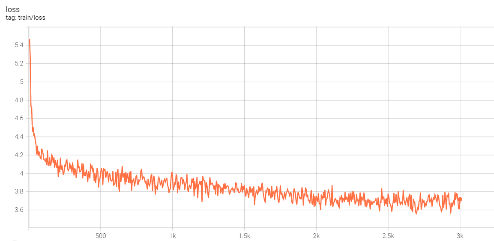

# chatglm_tuning: 基于 LoRA 和 P-Tuning v2 的 ChatGLM-6B 高效参数微调

[ChatGLM-6B](https://github.com/THUDM/ChatGLM-6B) 是一个清华开源的、支持中英双语的对话语言模型，基于 [General Language Model (GLM)](https://github.com/THUDM/GLM) 架构，具有 62 亿参数。经过约 1T 标识符的中英双语训练，辅以监督微调、反馈自助、人类反馈强化学习等技术的加持，62 亿参数的 ChatGLM-6B 已经能生成相当符合人类偏好的回答。

本仓库实现了对于 ChatGLM-6B 模型基于 LoRA 和 P-Tuning v2 的参数高效微调。

## Requirements

- transformers==4.28.1

- datasets==2.10.1

- cpm_kernels

- torch==1.13.0+cu116

- peft==0.3.0.dev0

- gradio==3.27.0

## P-Tuning v2

[P-Tuning v2](https://github.com/THUDM/P-tuning-v2) 是清华大学开源的语言模型提示微调方法，在 3 亿到 100 亿参数的广阔参数规模上，均能仅以 0.1%～3% 的微调参数量，取得和精调方法媲美的迁移效果。

下面以 [ADGEN](https://aclanthology.org/D19-1321.pdf) (广告生成) 数据集为例介绍 P-Tuning v2 的微调方法。ADGEN 数据集的任务为根据输入 (content) 生成一段广告词 (summary)：

```json
{
    "content": "类型#裤*版型#宽松*风格#性感*图案#线条*裤型#阔腿裤", 
    "summary": "宽松的阔腿裤这两年真的吸粉不少，明星时尚达人的心头爱。毕竟好穿时尚，谁都能穿出腿长2米的效果宽松的裤腿，当然是遮肉小能手啊。上身随性自然不拘束，面料亲肤舒适贴身体验感棒棒哒。系带部分增加设计看点，还让单品的设计感更强。腿部线条若隐若现的，性感撩人。颜色敲温柔的，与裤子本身所呈现的风格有点反差萌。"
}
```
对原始数据进行预处理，改变其列名:
```shell
cd data/AdvertiseGen/
python convert_to_instruct.py --input_file train.json --output_file train.jsonl
```

运行以下命令进行训练：

```shell
export CUDA_VISIBLE_DEVICES=0
python train_ptuning.py \
--train_args_file chatglm_6b_ptuning.json \
--model_name_or_path /path/to/chatglm-6b \
--data_path data/AdvertiseGen/train.jsonl \
--pre_seq_len 128 \
--quantization_bit 4
```

如果想进行单机多卡分布式训练，可运行如下命令：

```shell
export CUDA_VISIBLE_DEVICES=0,1,2,3
torchrun --nproc_per_node=4 train_ptuning.py \
--train_args_file chatglm_6b_ptuning.json \
--model_name_or_path /path/to/chatglm-6b \
--data_path data/AdvertiseGen/train.jsonl \
--pre_seq_len 128 \
--quantization_bit 4
```

chatglm_6b_ptuning.json 为训练参数配置文件：

```json
{
    "output_dir": "output/adgen-chatglm-6b-ptuning",
    "per_device_train_batch_size": 4,
    "gradient_accumulation_steps": 4,
    "learning_rate": 2e-2,
    "num_train_epochs": 1.0,
    "max_steps": 3000,
    "lr_scheduler_type": "cosine",
    "logging_steps": 5,
    "save_strategy": "no",
    "optim": "adamw_torch",
    "fp16": false,
    "remove_unused_columns": false,
    "ddp_find_unused_parameters": false,
    "report_to": "tensorboard"
}
```

在`quantization_bit=4`、`per_device_train_batch_size=4`、`gradient_accumulation_steps=4`、`fp16=false` 的配置下，单卡只需 8.6G 显存便可对 ChatGLM-6B 模型进行微调。微调过程中 loss 的变化如下图所示：



在 P-tuning v2 训练时模型只保存 PrefixEncoder 部分的参数，所以在推理时需要同时加载原 ChatGLM-6B 模型以及 PrefixEncoder 的权重。

```shell
python cli_demo.py \
--model_name_or_path /path/to/chatglm-6b \
--ptuning_checkpoint output/adgen-chatglm-6b-ptuning/ \
--pre_seq_len 128 \
--quantization_bit 4 \
--no_history
```

微调前后的输出示例：

- 用户: 类型#裤\*风格#休闲\*风格#潮\*裤款式#口袋\*裤款式#纽扣\*裤口#卷边

- ChatGLM-6B [微调前]: 裤款式#休闲#潮#口袋#纽扣#裤口#卷边
  
  1. 裤款式：休闲裤。
  2. 口袋：有两个口袋。
  3. 纽扣：裤子上的纽扣数量为8。
  4. 裤口：裤子的裤口形状为卷边。
  5. 卷边：裤子上的卷边长度为3厘米。

- ChatGLM-6B [微调后]: 休闲的裤子是夏天必不可少的单品，这款裤子采用时尚卷边设计，展现出个性潮范，搭配纽扣装饰，更加帅气有型。裤子两侧口袋装饰，增加造型层次感，方便实用。
***

- 用户: 类型#裙\*材质#蕾丝\*颜色#墨绿色\*风格#清新\*图案#撞色\*图案#蕾丝\*裙长#长裙\*裙款式#勾花镂空

- ChatGLM-6B [微调前]: 一款清新风格的勾花镂空长裙，材质为墨绿色蕾丝，颜色为墨绿色，裙长为长裙。

- ChatGLM-6B [微调后]: 墨绿色的长裙，清新雅致，又带着一丝甜美气息。蕾丝镂空的设计，将女性的柔美与温婉的气质展现的淋漓尽致，同时，又给整体增添了几分浪漫的气息。撞色的领口设计，轻松增添了几分俏皮的气息，又让整体显得活力十足。

## LoRA

[LoRA](https://github.com/microsoft/LoRA) 的实现思想很简单，如下图所示，就是冻结一个预训练语言模型的矩阵参数，并选择用 `A` 和 `B` 矩阵来替代，在下游任务时只更新 `A` 和 `B`。



 LoRA 的实现流程概况如下：

- 在原始预训练语言模型 (PLM) 旁增加一个旁路，做一个先降维再升维的操作，以此来模拟所谓的内在秩；

- 训练的时候固定 PLM 的参数不变，只训练降维矩阵 `A` 和升维矩阵 `B`，即优化器只优化右路的参数；

- 模型的输入、输出维度不变，左右两边共用模型的输入，输出时将 PLM 与 `A-B` 的输出叠加；

- 用随机高斯分布 $N(0,\sigma^2)$ 初始化 `A`，用全零矩阵初始化 `B`。矩阵 `B` 的全零初始化，使得在训练最开始的一段时间，右路的结果会接近于0，这样模块的输出就基本上来自于左路，也就是大模型原有参数的计算结果，这使得模型优化的初始点就和原始的大模型保持一致。

下面使用 [ADGEN](https://aclanthology.org/D19-1321.pdf) (广告生成) 数据集，基于 HuggingFace peft 库中的 LoRA 在 ChatGLM-6B 上进行参数微调。

运行如下命令进行单机多卡分布式训练：

```shell
torchrun --nproc_per_node=2 train_lora.py \
--train_args_file chatglm_6b_lora.json \
--model_name_or_path /path/to/chatglm-6b/ \
--data_path data/AdvertiseGen/train.jsonl \
--max_input_length 128 \
--max_output_length 256
```

在 `per_device_train_batch_size=3`、`gradient_accumulation_steps=4`、`fp16=false` 的配置下，训练大约需要 16G 单卡显存。微调过程中 loss 的变化如下图所示：



训练完成后，运行如下命令进行推理：

```shell
python cli_demo.py \
--model_name_or_path /path/to/chatglm-6b/ \
--lora_checkpoint output/adgen-chatglm-6b-lora/ \
--no_history
```

部分输出示例如下：

- 用户: 类型#上衣\*材质#牛仔布\*颜色#白色\*风格#简约\*图案#刺绣\*衣样式#外套\*衣款式#破洞

- ChatGLM-6B [微调后]: 牛仔外套一直是时尚界的经典单品，无论是男女都可以穿。这件牛仔外套采用简约的直筒版型，配合白色织带的设计，凸显时尚个性。衣身采用破洞、破边、刺绣等元素点缀，带来新颖别致的时尚造型。
***

- 用户: 类型#裤\*版型#显瘦\*材质#网纱\*风格#潮\*裤长#七分裤\*裤款式#纱网

- ChatGLM-6B [微调后]: 一款时髦的网纱七分裤，采用时尚网纱面料，轻盈飘逸，带来灵动的气息，搭配七分裤型，轻松穿出时髦潮流感。腰部设计简洁，不挑身材，穿着舒适又显瘦。
***

- 用户: 类型#裙\*材质#蕾丝\*颜色#墨绿色\*风格#清新\*图案#撞色\*图案#蕾丝\*裙长#长裙\*裙款式#勾花镂空

- ChatGLM-6B [微调后]: 清新淡雅的墨绿色调，搭配着蕾丝的裙身，给人一种甜美可爱的少女气息，十分迷人。镂空的蕾丝花纹，在裙摆处点缀着，散发出优雅的魅力。裙身的撞色设计，让裙身看起来更加有层次感，充满了时尚的气息。长裙的长度，能够很好地遮盖住大腿的赘肉，让身材更显高挑。

## 引用

若使用本项目的训练代码，请引用本项目。

```
@misc{chatglm_tuning,
  author = {Zejun Wang},
  title = {chatglm_tuning: 基于 LoRA 和 P-Tuning v2 的 ChatGLM-6B 高效参数微调},
  year = {2023},
  publisher = {GitHub},
  journal = {GitHub repository},
  howpublished = {\url{https://github.com/zejunwang1/chatglm_tuning}},
}
```

## Contact

邮箱：[wangzejunscut@126.com](mailto:wangzejunscut@126.com)

微信：autonlp
